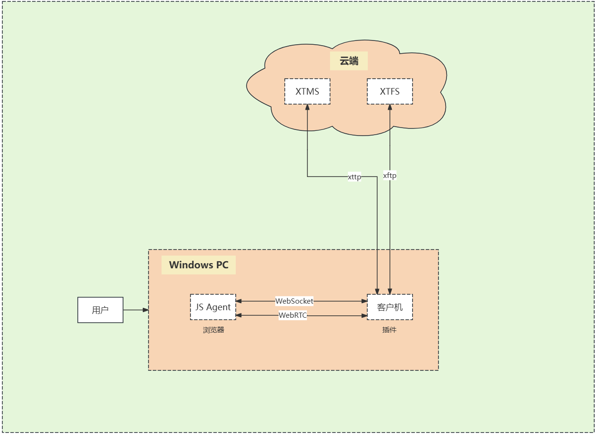
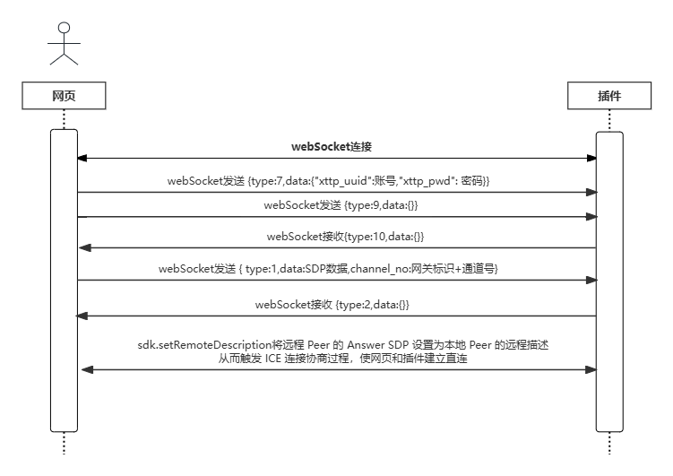
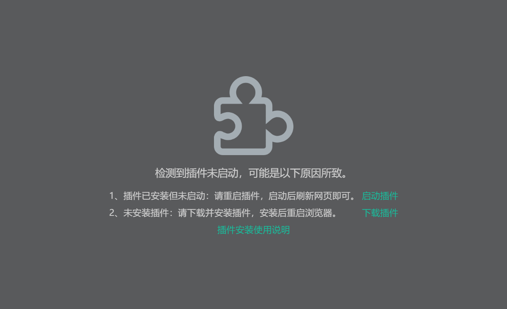
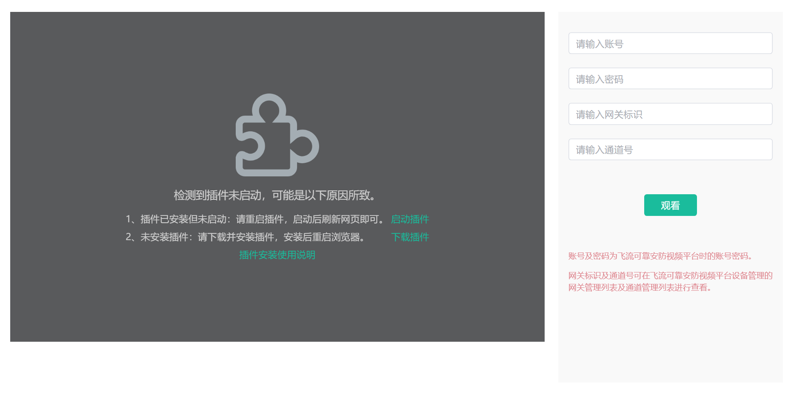

# XtERVGWebDemo
## Introduction
This project mainly consists of the XtERVG front-end code, which, when paired with the FlyStream Edge AI Video Gateway, can perfectly solve issues such as jitter, delay, and screen corruption in video remote transmission. It also enables ultra-low latency remote real-time playback of AI-annotated video streams.

## Architecture Description

1. The embedded xftp media player is composed of a JS Agent running on the browser side and a client plugin;
2. The client plugin is responsible for connecting and communicating with the XTMS (xttp signaling server) and XTFS (xftp media server) in the cloud;
3. The xttp protocol is a signaling protocol responsible for transmitting control signaling (such as media stream identification information, cloud notification information, etc.) between the cloud and the browser;
4. The xftp protocol is a media stream transmission protocol responsible for receiving media stream data from the cloud;
5. The JS Agent is responsible for receiving user operation commands from the web page (such as start playback, stop playback, etc.);
6. The JS Agent communicates signaling with the client plugin via WebSocket (such as logging into xtms service, starting remote live broadcast, initiating media stream download, ending WebRTC media stream information, SDP exchange, etc.);
7. The JS Agent communicates media streams with the client plugin via WebRTC, obtaining the media stream and rendering it to the browser window.

## Sequence Diagram


## Code Description
1. Open the webpage to establish a WebSocket connection with the local plugin (WebSocket address: ws://localhost:1234).
    ```bash
    // Create WebSocket connection
      const socket = new SocketService('ws://localhost:1234/',onOpen,onMessage,onClose)
      ws = socket.getWebSocket()
    ```
2. If the WebSocket connection fails or is not established, the webpage prompts the user to start the plugin. Upon clicking the "Start Plugin" button, the browser launches the local plugin and reloads the webpage to establish the WebSocket connection.

    

3. If the WebSocket connection is active, enter the account, password, gateway identifier, and channel number.

    

    (1) Click "Watch" to send the following message via WebSocket to the plugin: `{type:7,data:{"xttp_uuid": account,"xttp_pwd": password}}`. Then send `{type:9,data:{}}` to notify the plugin to prepare for live broadcasting.
    ```bash
    {
      "type": 7,
      "data": {
        "xttp_uuid": "",
        "xttp_pwd": ""
      }
    }

    {
      "type": 9,
      "data": {}
    }
    ```
    (2) After sending the `{type:9,data:{}}` message, wait for the plugin's response. Upon receiving `{type:10}`, send `{type:1,data:SDP data,channel_no:gateway identifier+channel number}` to the plugin.
    ```bash
    {
      "data": {},
      "type": 10
    }

    {
      "data": {
        "answer": 1
      },
      "type": 6
    }

    {
      "type": 1,
      "data":SDP,
      "channel_no": "43c50b70203d1d7c6e341bc027b4bc77001"
    }
    ```
    (3) Wait for the plugin's message. Upon receiving `{type:2,data:SDP response}`, set the received SDP response (Answer) as the remote description of the current WebRTC connection to establish the media stream connection.
    ```bash
    {
      "data": SDP,
      "type": 2
    }
    ```

4. Additional Information:

    (1) `{ "type":4,"data":{width: original video width,height: original video height}}` can be used to compare with the current page player's width and height to proportionally scale up the annotation information.
    ```bash
    {
      "data": {
        "height": 1080,
        "width": 1920
      },
      "type": 4
    }
    ```
    (2) `{ "type":3,"data": video annotation information}` contains video annotation information.
    - width: Video width,
    - height: Video height,
    - annotation_item_arr: Video annotation data (xmin_1m, ymin_1m are the top-left coordinates of the annotation, xmax_1m, ymax_1m are the bottom-right coordinates of the annotation, id: the content id corresponding to the annotation)
    ```bash
    {"data":{"anno_ts":173766,"annotation_item_arr":[{"conf_level_1m":686440,"id":2,"xmax_1m":569847104,"xmin_1m":412274272,"ymax_1m":1079401984,"ymin_1m":964176896},{"conf_level_1m":663714,"id":2,"xmax_1m":1094089856,"xmin_1m":964092224,"ymax_1m":576731840,"ymin_1m":470370144},{"conf_level_1m":646576,"id":2,"xmax_1m":1000150528,"xmin_1m":866213568,"ymax_1m":678833728,"ymin_1m":545881664},{"conf_level_1m":597909,"id":2,"xmax_1m":1351361664,"xmin_1m":1205606784,"ymax_1m":945765952,"ymin_1m":843835968},{"conf_level_1m":590103,"id":2,"xmax_1m":1781665024,"xmin_1m":1659546112,"ymax_1m":501732224,"ymin_1m":404234080},{"conf_level_1m":572435,"id":7,"xmax_1m":999240320,"xmin_1m":857424768,"ymax_1m":679345728,"ymin_1m":548609472},{"conf_level_1m":548956,"id":2,"xmax_1m":1211665024,"xmin_1m":1077728128,"ymax_1m":456390944,"ymin_1m":334518176},{"conf_level_1m":548589,"id":2,"xmax_1m":734089792,"xmin_1m":596213568,"ymax_1m":239743792,"ymin_1m":153324928},{"conf_level_1m":548241,"id":2,"xmax_1m":1284393216,"xmin_1m":1174092288,"ymax_1m":386675072,"ymin_1m":286960992},{"conf_level_1m":540958,"id":2,"xmax_1m":798029120,"xmin_1m":668031552,"ymax_1m":164232256,"ymin_1m":53438860},{"conf_level_1m":536680,"id":7,"xmax_1m":663065408,"xmin_1m":405637184,"ymax_1m":1079283200,"ymin_1m":809244416},{"conf_level_1m":531469,"id":7,"xmax_1m":1092575232,"xmin_1m":966516992,"ymax_1m":577243776,"ymin_1m":470882112},{"conf_level_1m":526462,"id":7,"xmax_1m":1786514560,"xmin_1m":1660456320,"ymax_1m":503096192,"ymin_1m":405597984},{"conf_level_1m":522815,"id":2,"xmax_1m":666211200,"xmin_1m":492881056,"ymax_1m":982583744,"ymin_1m":807530176},{"conf_level_1m":520910,"id":2,"xmax_1m":1344393216,"xmin_1m":1234092288,"ymax_1m":308947648,"ymin_1m":198154288},{"conf_level_1m":508335,"id":7,"xmax_1m":1356211200,"xmin_1m":1206516992,"ymax_1m":948493760,"ymin_1m":844348032},{"conf_level_1m":502188,"id":7,"xmax_1m":567422336,"xmin_1m":405910176,"ymax_1m":1079062016,"ymin_1m":968268672},{"conf_level_1m":488414,"id":7,"xmax_1m":662271872,"xmin_1m":492881056,"ymax_1m":983947712,"ymin_1m":806678208},{"conf_level_1m":478413,"id":2,"xmax_1m":1284393216,"xmin_1m":1170152960,"ymax_1m":453663072,"ymin_1m":285257120},{"conf_level_1m":477324,"id":2,"xmax_1m":603786432,"xmin_1m":469849504,"ymax_1m":376959648,"ymin_1m":277245600},{"conf_level_1m":455104,"id":7,"xmax_1m":899847104,"xmin_1m":769849472,"ymax_1m":765936576,"ymin_1m":628552768},{"conf_level_1m":452223,"id":2,"xmax_1m":475907776,"xmin_1m":334092224,"ymax_1m":469686144,"ymin_1m":325654720}],"annotion_item_len":22,"height":1080,"width":1920},"type":3}
    ```
    (3) `{data: {version: "1.0.4"},"type":11}`, the plugin version number, which can be compared with the server version to prompt the user to upgrade.
    ```bash
    {
      "data": {
        "version": "1.0.7"
      },
      "type": 11
    }
    ```
    (4) When switching channels or closing the webpage, send `{"type":8,"data":{}}` to notify the plugin to close the video.
    ```bash
    {
      "type": 8,
      "data": {}
    }
    ```
    (5) The plugin queries the browser's login status `{"type":12,"data":{}}`.
    ```bash
    {
      "type": 12,
      "data": {}
    }
    ```
    (6) The browser notifies the plugin of xttp re-login or logout `{"type":13,"data":{"need_relogin": 0 }}`, where 0 indicates logout and 1 indicates re-login.
    ```bash
    {
      "type":13,
      "data":{
        "need_relogin": 0 
      }
    }
    ```

## Appendix
1. WebSocket Signaling Format Description:

    (1) The signaling is in JSON format;

    (2) The `type` represents the specific signaling type.

2. Specific WebSocket Signaling Formats are as follows:

    (1) JS Agent sends offer SDP to the client plugin (`type: 1`)

     **Complete Command:**
    ```bash
        {
            "type": 1,
            "data": "offer sdp",
            "channel_no": "1d0****001"
        }
    ```

     **Data Field Description:**
    -	data: The specific content of the offer SDP.
    -	channel_no: The media stream channel number.

    (2) Client plugin sends answer SDP to JS Agent (`type: 2`)

     **Complete Command:**
    ```bash
        {
            "type": 2,
            "data": "answer sdp"
        }
    ```

     **Data Field Description:**

    -	data: The specific content of the answer SDP.

    (3) Client plugin sends annotation data to JS Agent (`type: 3`)

     **Complete Command:**
    ```bash
     {
            "type": 3,
            "data": {
                "anno_ts": 0,
                "annotation_item_arr": [
                    {
                        "conf_level_1m": 747859,
                        "id": 0,
                        "xmax_1m": 902554560,
                        "xmin_1m": 664839232,
                        "ymax_1m": 505652640,
                        "ymin_1m": 352369760
                    },
                    {
                        "conf_level_1m": 747858,
                        "id": 1,
                        "xmax_1m": 902554559,
                        "xmin_1m": 664839231,
                        "ymax_1m": 505652639,
                        "ymin_1m": 352369759
                    }
                ],
                "annotion_item_len": 2,
                "height": 1080,
                "width": 1920
            }
        }
    ```

     **Data Field Description:**
    -	data: Annotation data
    - anno_ts: Timestamp
    - annotation_item_arr: Annotation array
    - conf_level_1m: Annotation confidence level
    - id: Annotation ID (corresponding to specific annotation type)
    - xmax_1m: X-coordinate of the bottom-right vertex of the annotation rectangle
    - xmin_1m: X-coordinate of the top-left vertex of the annotation rectangle
    - ymax_1m: Y-coordinate of the bottom-right vertex of the annotation rectangle
    - ymin_1m: Y-coordinate of the top-left vertex of the annotation rectangle
    - annotion_item_len: Length of the annotation array
    - height: Video height
    - width: Video width

    (4) Client plugin sends video size to JS Agent (`type: 4`)

     **Complete Command:**
    ```bash
        {
            "type": 4,
            "data": {
                "height": 1080,
                "width": 1920
            }
        }
    ```

     **Data Field Description:**

    -	data: Size data
    - height: Video height
    - width: Video width

    (5) JS Agent sends signaling to the client plugin: Query the status of the client plugin, currently a reserved command not in use (`type: 5`)

     **Complete Command:**
    ```bash
        {
            "type": 5,
            "data": {}
        }
    ```

    (6) Client plugin sends reply signaling to JS Agent: Represents the plugin status (`type: 6`)

     **Complete Command:**

    ```bash
        {
            "type": 6,
            "data": {
                "answer": 1
            }
        }
    ```

     **Data Field Description:**

    -	data: Data
    - answer: 0 indicates not logged in or disconnected, 1 indicates login successful.

    (7) JS Agent sends account and password to the client plugin (`type: 7`)

     **Complete Command:**

    ```bash
        {
            "type": 7,
            "data": {
                "xttp_uuid": "1d0****001",
                "xttp_pwd": "1****6"
            }
        }
    ```

     **Data Field Description:**

    -	data: Data
    - xttp_uuid: Account
    - xttp_pwd: Password

    (8) JS Agent sends signaling to the client plugin: Close playback (`type: 8`)

     **Complete Command:**

    ```bash
        {
            "type": 8,
            "data": {}
        }
    ```

    (9) JS Agent sends signaling to the client plugin: Query the playback status of the plugin before playing video (`type: 9`)

     **Complete Command:**

    ```bash
       {
            "type": 9,
            "data": {}
        }
    ```

    (10) Client plugin sends reply to JS Agent: Playback conditions are ready (`type: 10`)

     **Complete Command:**

    ```bash
        {
            "type": 10,
            "data": {}
        }
    ```

    (11) Client plugin sends plugin version number to JS Agent (`type: 11`)

     **Complete Command:**

    ```bash
        {
            "type": 11,
            "data": {
                "version": "1.0.0"
            }
        }   
    ```

     **Data Field Description:**

    -	data: Data
    - version: Plugin version number

    (12) Client plugin sends signaling to JS Agent: Query the login status of the browser (`type: 12`)

     **Complete Command:**
    ```bash
        {
            "type": 12,
            "data": {
            }
        }
    ```

    (13) Client plugin sends signaling to JS Agent: Notify the browser to log out (`type: 14`)

     **Complete Command:**

    ```bash
        {
            "type": 14,
            "data": {
            }
        }
    ```

## Contact Us
**If you encounter any issues during development that you cannot resolve, you can contact us through the following methods:**

Contact Number: 010-64759451

WeChat QR Code: Scan the QR code below to obtain the group QR code, and then long press to identify the QR code to join the group.


